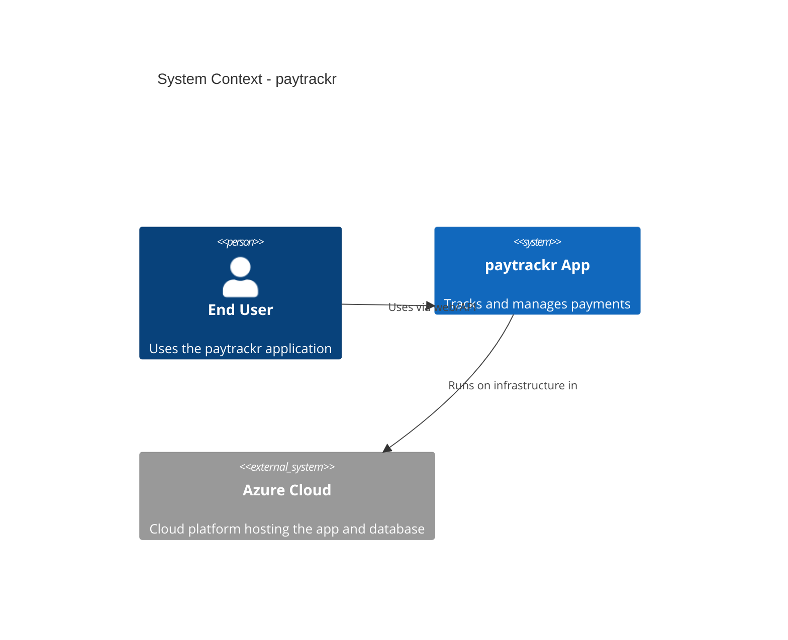
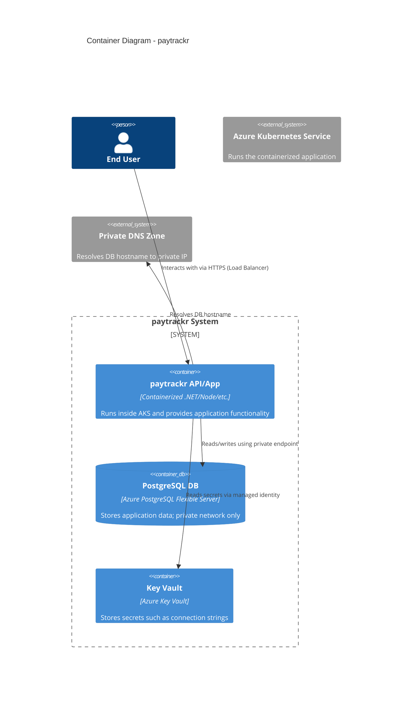
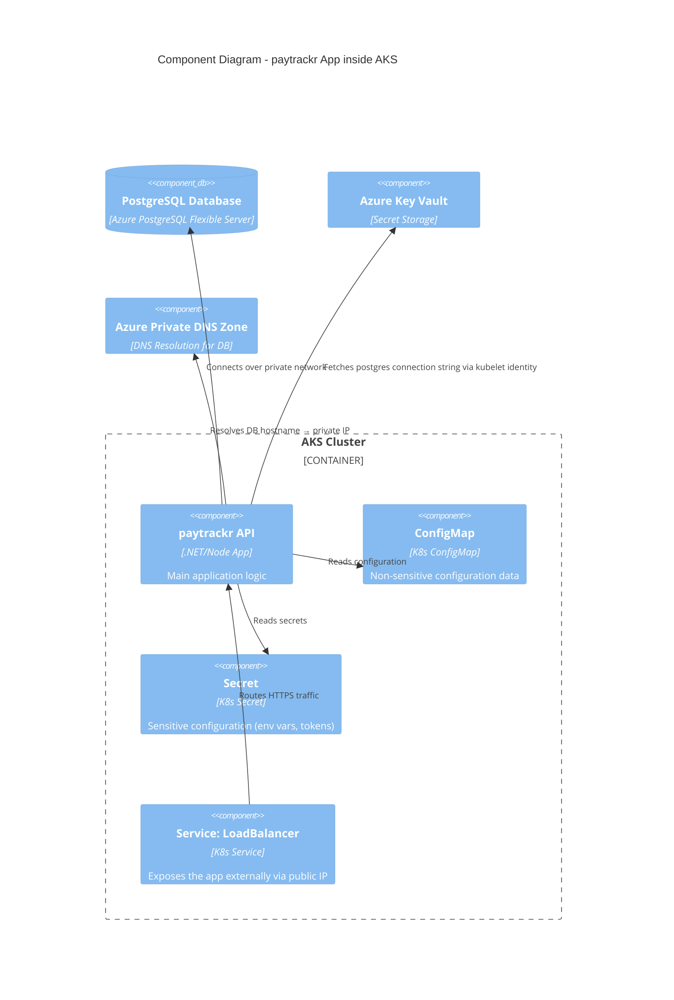

# C4 Model for **paytrackr**

Below is a full C4 representation (Levels 1–3) of the `paytrackr` infrastructure and application architecture, using Mermaid's C4 syntax.

---

## **C4 Level 1 – System Context**

---

## **C4 Level 2 – Container Diagram**

---

## **C4 Level 3 – Component Diagram (Inside AKS)**

---

If you want, I can also generate:

* **C4 Level 4 (Code/Module)** diagram
* A **single combined high‑level C4 poster**
* A **rendered PNG/SVG** version via mermaid
* A **cleaned-up version for documentation or Terraform repo**

Just tell me!
